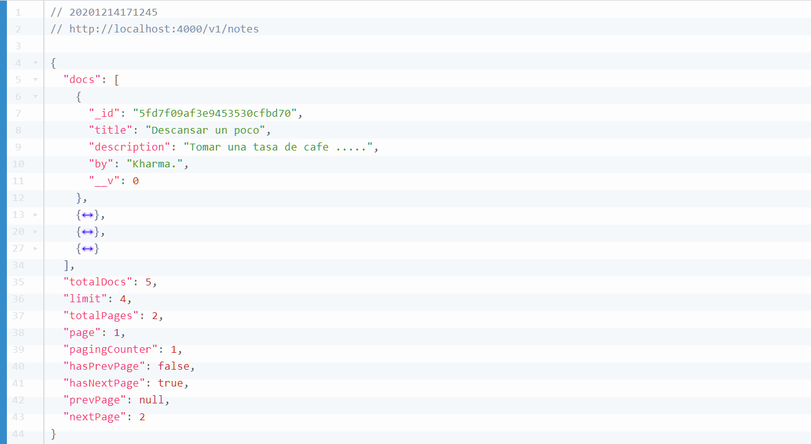
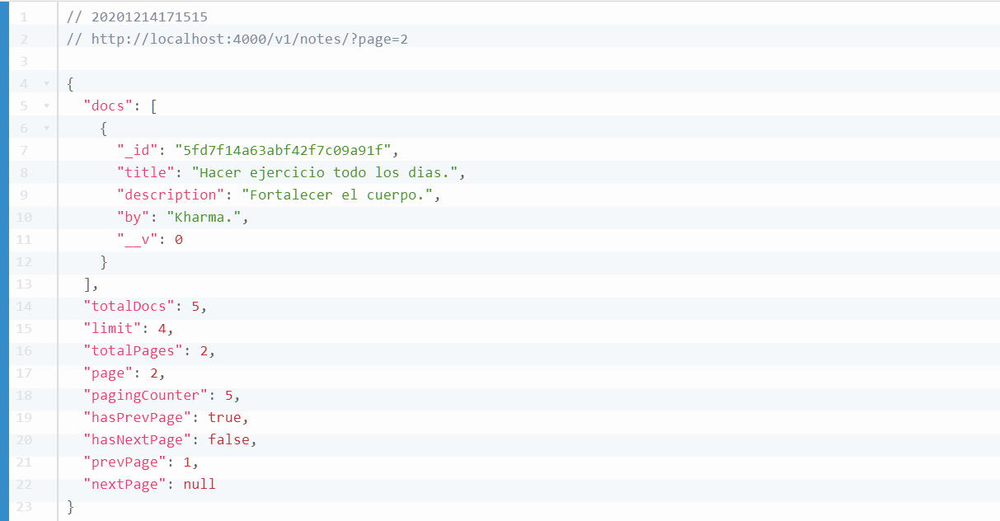
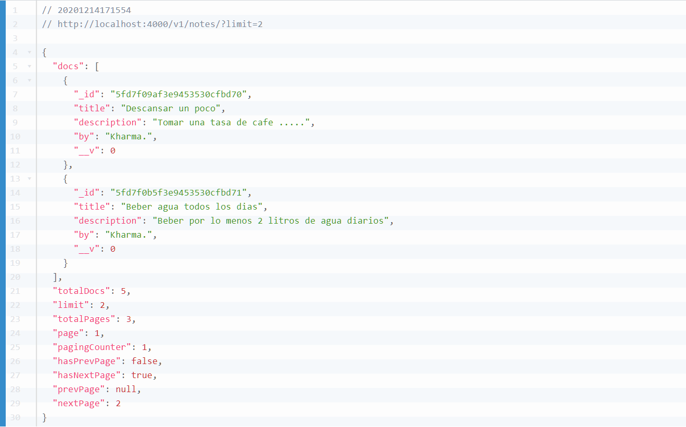

    

# API NOTE MONGOOSE PAGINATE V2

## Antes de comenzar

### Ejecutar el siguiente comando en la terminal: 
    $ npm install

### Congifurar la base de datos de mongoDB en el archivo src/databse.js:
    >> mongoose.connect('mongodb://localhost/<nombre-database>', {

### Ejecutar lo siguiente en terminal:
    $ nodemon src/index.js

### Sobre como funciona

###### Muestra toda la colección

    

###### Muestra la página a especificar

    

###### Limitar la cantidad de colecciones en la pagina   

    

### Para mas información consulat la pagina de Mongoose Paginate v2
[Mongoose-paginate-v2](https://www.npmjs.com/package/mongoose-paginate-v2).
